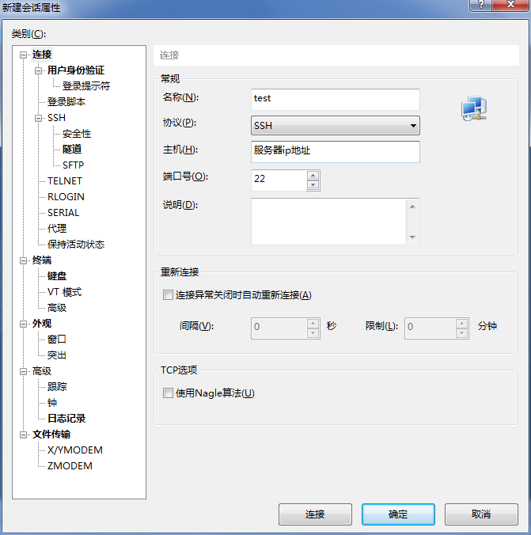
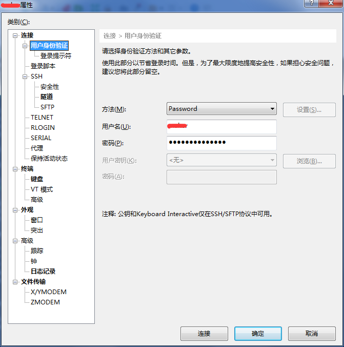
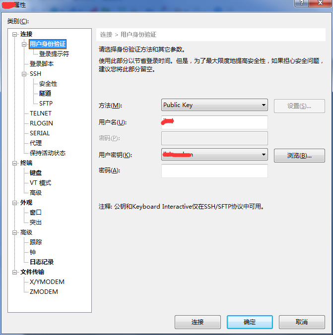
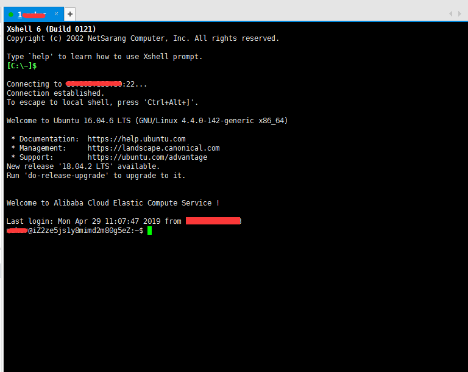
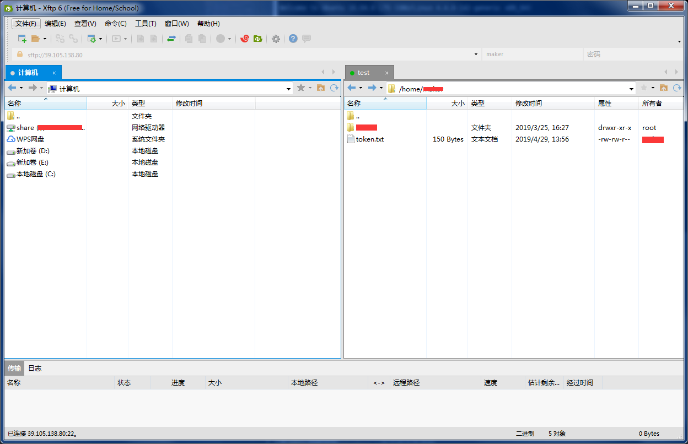

# Xshell
在 `Windows` 界面下用来访问远端不同系统下的服务器

## 下载
个人使用推荐选择免费版[传送门](https://www.netsarang.com/zh/free-for-home-school/)

## 新建连接
1.打开 `Xshell`，点击文件，选择新建选项，输入名称、主机、端口号，如下图

2.若有服务器账号密码时在用户身份验证配置中方法选择 `Password` 设置账号密码，点击连接即可，如下图

3.若有 `ssh` 公钥在用户身份验证配置中方法选择 `Public Key`，点击浏览导入公钥文件，点击连接即可，如下图

4.如看到如下图表明连接成功

## Xftp
文件传输工具 文件传输的可视化工具（不推荐使用，能用命令就尽量不用鼠标）

### 前提
>1.前往官网下载 `Xftp` [传送门](https://www.netsarang.com/zh/free-for-home-school/) 
>2.服务器系统安装 `lrzsz` [传送门](https://blog.csdn.net/qq_36818702/article/details/83817838) 

### Xftp使用
1.在 `Xshell` 工作区中选择新建文件传输功能，如下图

2.在 `Xftp` 中即可如 `Windows` 一样实现文件传输，如下图

### 采用命令方式上传文件
1.安装了`lrzsz`，配置 `rz` 命令即可使用 `rz` 命令打开本地文件资源管理器，选择文件以后即可实现上传文件